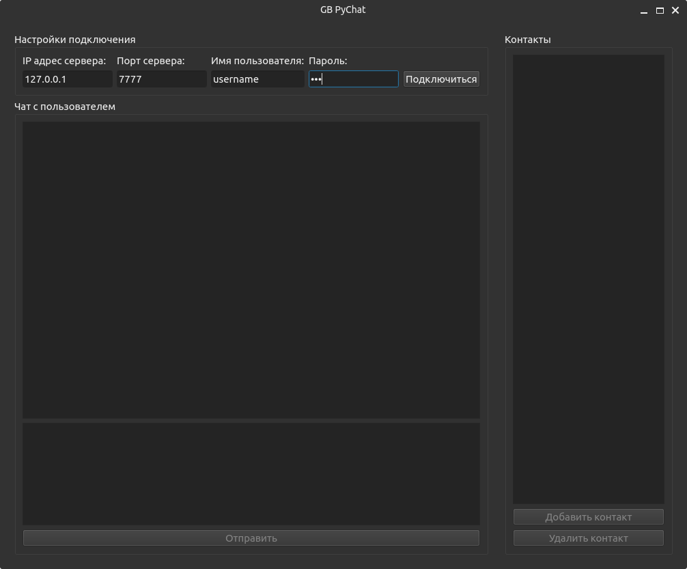

Запуск клиента
==============

Скрипт "client.pyw"
-------------------

Скрипт запуска графического интерфейса клиентского приложения мессенджера. 

Хранение истории сообщений осуществляется исключительно на клиенте.

Использование:
``poetry run python client.pyw``

Для подключения к серверу необходимо указать адрес, порт, имя пользователя и пароль.

Отправка сообщений с пометкой **[Не доставлено]** осуществляется при отправке любого сообщения адресату (допустимо и пустое), если адресат онлайн.
