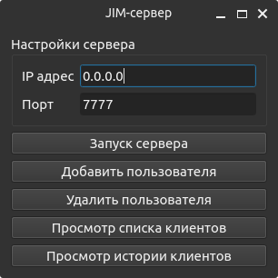

Запуск сервера
==============

Скрипт "run_server_gui.pyw"
---------------------------

Запускаемый модуль графического интерфейса управления сервером.

Использование:
``poetry run python run_server_gui.pyw``

Скрипт "run_server_cli.py"
--------------------------

Запускаемый модуль ядра сервера без графического интерфейса, содержит парсер аргументов командной строки и функционал инициализации приложения.

**Использование**

Модуль подерживает аргументы командной строки:

1. ``-a``, ``--address`` - IP адрес или имя сервера, с которого принимаются соединения.
2. ``-p``, ``--port`` - порт сервера, на котором принимаются соединения

По умолчанию используется комбинация ``127.0.0.1:7777``

Примеры использования:

``poetry run python run_server_cli.py``

*Запуск сервера с настройками по умолчанию на* ``127.0.0.1:7777``

``poetry run python run_server_cli.py -p 8080``

*Запуск сервера на порту 8080*

``poetry run python run_server_cli.py -a localhost``

*Запуск сервера принимающего только соединения с localhost*
